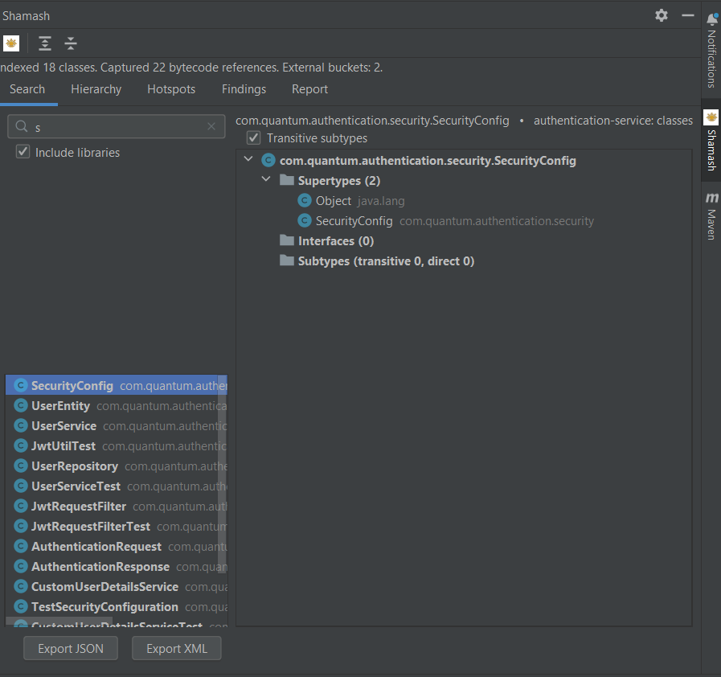
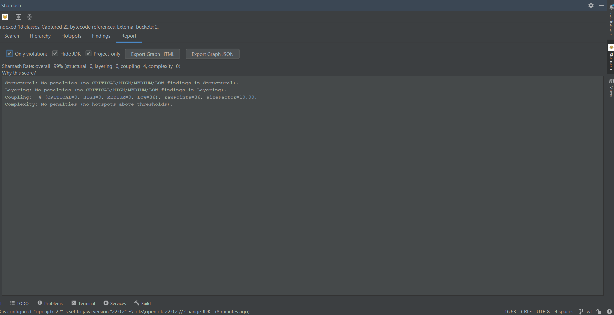
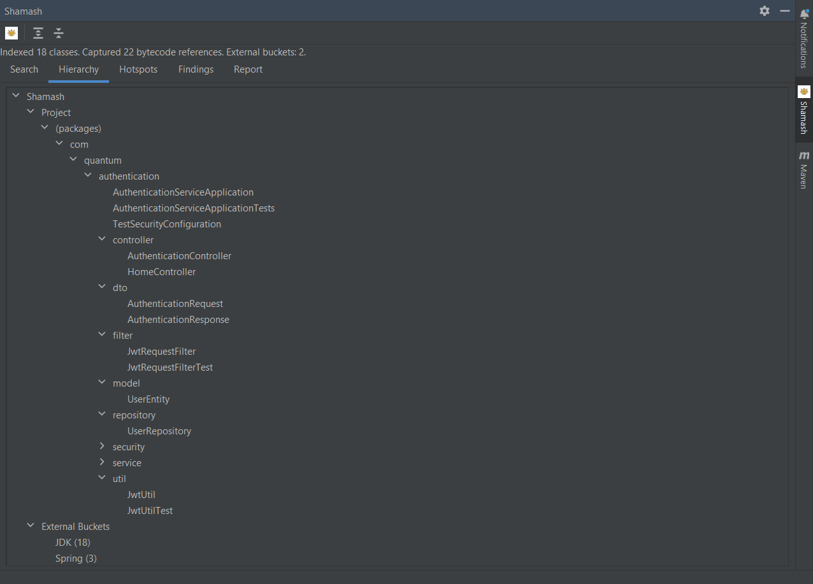
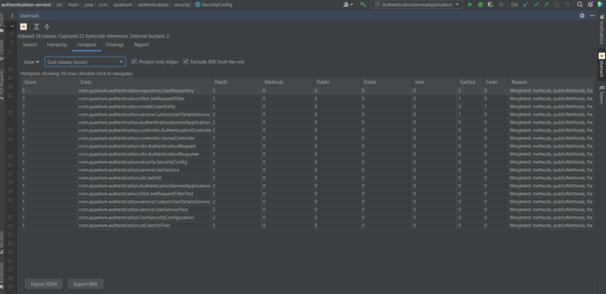
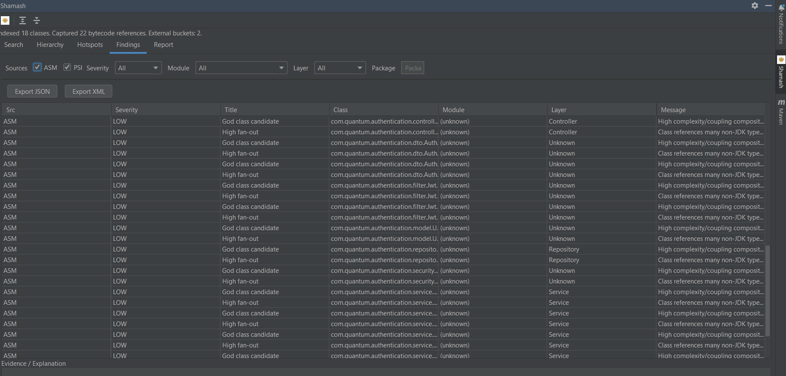
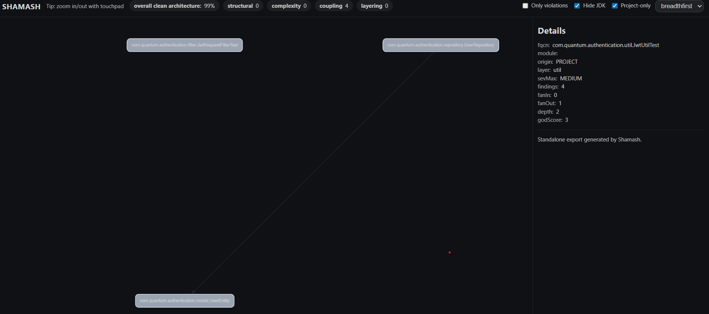

<p align="center">
  
</p>

[](https://github.com/aalsanie/shamash/releases) | [](https://plugins.jetbrains.com/plugin/29504-shamash) | [](https://www.apache.org/licenses/LICENSE-2.0.html)


# Shamash

Shamash is a refactoring/reporting tool that enforces clean architecture (operates on java codebases).
Deterministic & Fast (relies on bytecode for analysis using ASM).

### What It Offers?
- Architectural Dashboard (reports are exportable)
  - Hierarchy tab: search panel of project's hierarchical structure
  - Tree tab: view of project's hierarchical structure
  - Hotspots tab: dynamic analysis that shows architectural violations
  - Findings: displays severity/violations
- PSI inspections - displayed as warning in problems tab with fixes
  - violations of clean code
  - violations of clean architecture
- ASM bytecode scan, a complete hierarchical tree view

### How to use
- Download the plugin from intellij marketplace or build locally
- Run shamash scan from your left hand side or using 
  - Tools → Shamash: run scan
  - Tools → Shamash dashboard
- Open the dashboard and see your codebase reports including
  - overall architecture score 
  - graphs and reports of current hierarchy, issues and fixes

### Local Setup
To build
```shell
./gradlew clean buildplugin
```
To run
```shell
gradlew.bat spotlessApply --stacktrace
gradlew clean runIde
```

To verify plugin
```shell
./gradlew runPluginVerifier
```

- ASM for bytecode analysis
- PSI for static analysis
- Logging-based for cleanup actions (hybrid runtime signal)

All inspections are deterministic, reversible, and framework-aware where necessary.

### Demo
<p align="center">
  
  
  
  <br>
  
  
  <br>
  
</p>


## License

[LICENSE.md](LICENSE.md)

## Changelog

[Change-log](./CHANGELOG.md)
